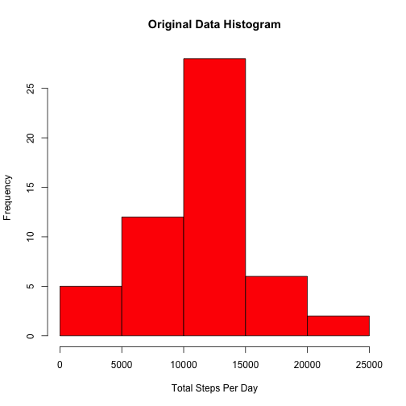
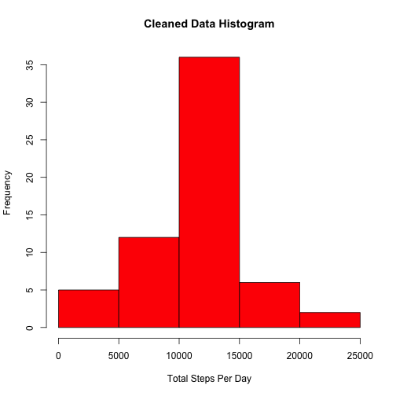

# Reproducible Research: Peer Assessment 1


## Loading and preprocessing the data

```r
data <- read.csv("activity.csv", header = TRUE)
cleanData <- data[!is.na(data$steps), ]
```


## What is mean total number of steps taken per day?

```r
sumStepsPerDay <- tapply(cleanData$steps, cleanData$date, FUN = sum)
hist(sumStepsPerDay, col = "red", xlab = "Total Steps Per Day", main = "Original Data Histogram")
```

 

```r

## get rid of NA's
spd <- sumStepsPerDay[!is.na(sumStepsPerDay)]

meanData <- mean(spd)
## print mean
meanData
```

```
## [1] 10766
```

```r
medianData <- median(spd)
## print median
medianData
```

```
## [1] 10765
```


## What is the average daily activity pattern?

```r
aspi <- tapply(cleanData$steps, factor(cleanData$interval), FUN = mean)
plot(as.numeric(rownames(aspi)), aspi, type = "l", ylab = "avg number of steps", 
    xlab = "five minute interval", lwd = 2)
```

 

```r
max <- aspi[aspi == max(aspi)]
## print maximum value. The name of numeric corresponds to the internal.
max
```

```
##   835 
## 206.2
```

```r
## Interval with maximum steps is
names(max)
```

```
## [1] "835"
```


## Imputing missing values

```r
naRows = is.na(data$steps) | is.na(data$date) | is.na(data$interval)
## number of rows with NA. I checked every field but NA's are in the steps
## column
sum(naRows)
```

```
## [1] 2304
```

```r

## add the mean for 5 minute interval to fill up the missing values first
## create a vector of averages which is the same length as data$interval note
## that aspi is the vector of averages for each interval from previous
## section.
stepAvg <- as.vector((aspi[as.character(data$interval)]))
filledData <- data
## make sure the correct step fields are updated
filledData$steps[is.na(filledData$steps)] <- stepAvg[is.na(filledData$steps)]

cleanSumStepsPerDay <- tapply(filledData$steps, filledData$date, FUN = sum)
hist(cleanSumStepsPerDay, col = "red", xlab = "Total Steps Per Day", main = "Cleaned Data Histogram")
```

 

```r
meanData <- mean(cleanSumStepsPerDay)
meanData
```

```
## [1] 10766
```

```r
medianData <- median(cleanSumStepsPerDay)
medianData
```

```
## [1] 10766
```


The mean and median are close to values computed in the first part of the assignment. However, the total number of steps for each day has gone up as can be seen from the new histogram. There are many more days with steps between 10000 and 15000.

## Are there differences in activity patterns between weekdays and weekends?

```r
a <- weekdays(as.Date(filledData$date, "%Y-%m-%d"))
a[a == "Saturday" | a == "Sunday"] <- "weekend"
a[a != "weekend"] <- "weekday"
filledData$daytype <- factor(a, labels = c("weekday", "weekend"))

# combine two factors
twofactor <- list(factor(filledData$interval), filledData$daytype)
aspit <- tapply(filledData$steps, twofactor, FUN = mean)
par(mfrow = c(2, 1))
par(mar = c(4, 4, 2, 2))
plot(as.numeric(rownames(aspit)), aspit[, 1], type = "l", ylab = "avg number of steps ", 
    xlab = "five minute interval", main = "weekday", ylim = c(0, 250), lwd = 1)
par(mar = c(4, 4, 2, 2))
plot(as.numeric(rownames(aspit)), aspit[, 2], type = "l", ylab = "avg number of steps ", 
    xlab = "five minute interval", main = "weekend", ylim = c(0, 250), lwd = 1)
```

 

